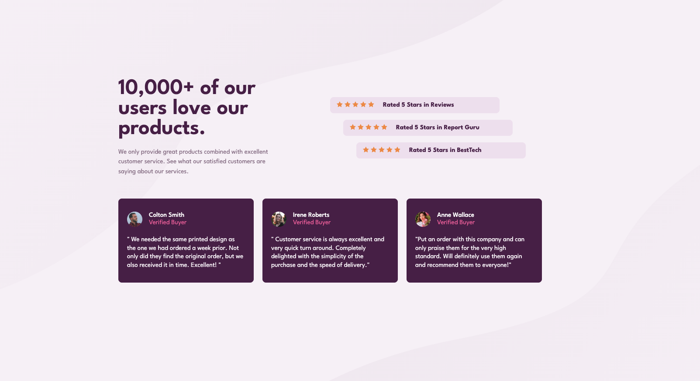

# Social Proof Section

Este é um projeto baseado no desafio Social Proof Section do Frontend Mentor. O objetivo é aprimorar habilidades em HTML, CSS (SCSS) e design responsivo.

## Visão Geral

O projeto apresenta uma seção de prova social que destaca avaliações e depoimentos de clientes satisfeitos com um serviço ou produto. O design moderno e responsivo garante uma boa experiência em diferentes dispositivos e tamanhos de tela.

## 📷 Captura de Tela

## 🚀 Tecnologias Utilizadas

- **HTML5**
- **CSS3 (SCSS)**

## 🎯 Funcionalidades

- ✅ Estruturação semântica com HTML5
- ✅ Estilização modularizada com SCSS
- ✅ Layout responsivo para diferentes dispositivos
- ✅ Utilização de imagens de fundo e elementos visuais interativos

## Agradecimentos

Agradeço ao Frontend Mentor pelos desafios incríveis que ajudam a melhorar minhas habilidades no desenvolvimento web!
